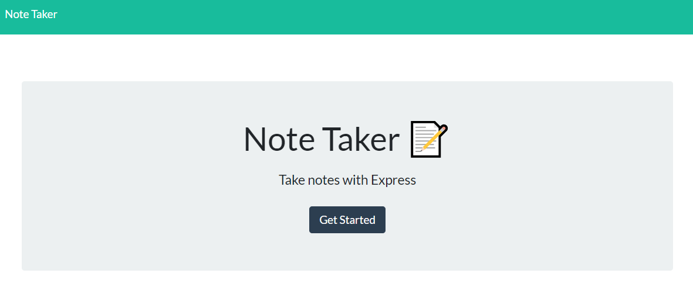

# Notes On Notes

## Description:
User can write and save notes to help them keep track and stay organized

## Licensing:

## Table of Contents 
* [Description](#description)
* [Installation](#installation)
* [Usage](#usage)
* [Technology](#technology)
* [Questions](#questions)
* [Screenshot](#Screenshot)

## Installation:
- Npm install
- Express install
- Node install

## Usage:
https://desolate-sands-26527.herokuapp.com/

## Technology:
- Express.js
- Node.js
- fs
- Heroku

## Questions:
Please reach me through my Github account or my email with any additional questions.
- Github: [tessaustin](https://github.com/tessaustin)
- Email: tessaustin92@gmail.com 

## Screenshot:

